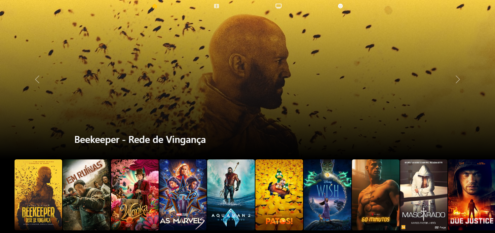

# Plataforma Semgranaflix

Este projeto não apenas aprimorou minhas habilidades técnicas, mas também me proporcionou uma compreensão mais profunda do ciclo de vida de desenvolvimento de software. A plataforma de streaming agora funciona como um testemunho do meu progresso e um lembrete constante de que o aprendizado contínuo é a essência da evolução no mundo da programação.

## Sobre a Semgranaflix

A Semgranaflix é um projeto criado por uma pessa sem grana, mas sem grana mesmo. 💸😂

### `Status`

Em Desenvolvimento

### `O que foi Usado?`

- React
 
- Node
 
- Bootstrap
 
- Axios
<!--  
- [www.themoviedb.org](www.themoviedb.org)
 
- [www.themoviedb.org](http://warezcdn.com/) -->

### `Galeria de Captura de Telas`

   

     
   

   

     
   

   

     
   

   

     
   

    
    

 <!--  
  | -->
